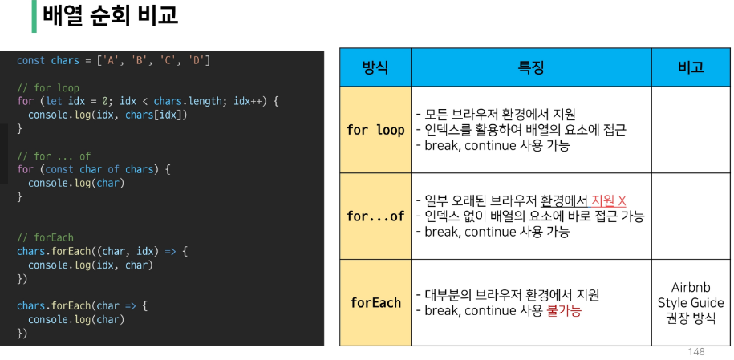
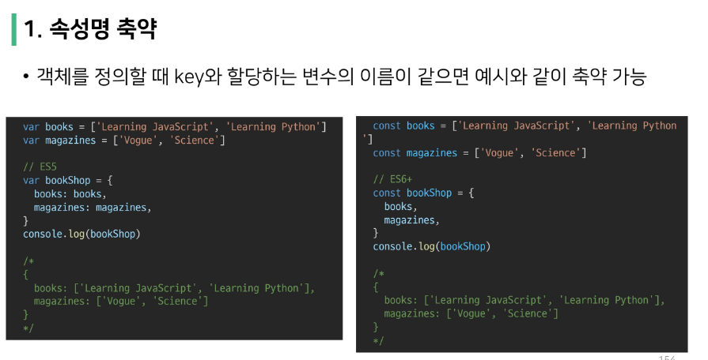
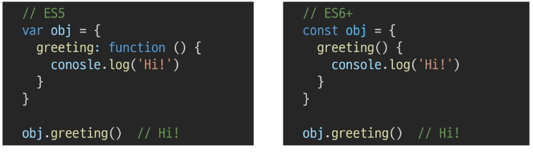
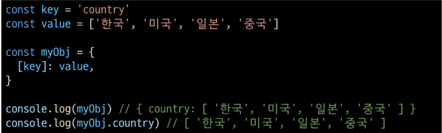

# 자바스크립트

배우는이유

가장 인기많고 동적웹에쓰이고 가장인기있다.

# 웹브라우저의 역할

url을 통해 web을 탐색함

html/css/js를 이해한뒤 해석해서 사용자에게 하나의 화면으로 보여줌

클라이언트 역할

처음 넷스케이프 브라우저

동적으로 바꿔줄 script언어 개발필요

모카개발 - 라이브스크립트로 변경- 인기에 기대고자 자스로변

자스랑 자바 관계 x

익스가 계속 독점하다가

2008년에 크롬등장

# 자바스크립트시작하기

1. 웹브라우저로 실행하기

2. node.js로 실행하기

## 세미콜론

- 자스는 세콜을 선택적으로 사용가능

- ASI에의해 자동으로 삽입됨

- 문법 및 개념적 측면에 집중하기 위해 세미콜론을 사용하지 않고 진행

## 코드스타일 가이드

- Airbnb Style Guide 기반으로 사용할 것

## 주석

// 한줄주석

/\* \*/ 여러줄 주석

## 식별자 정의와 특징

- 반드시 문자 달러 또는 밑줄로 시작

- 대소문자를 구분하며 클래스명 외에는 모두 소문자로 시작

- 예약어 사용 불가능


## 변수 선언 키워드

1. let - 블록 스코프 지역변수를 선언(추가로 동시에 값을 초기화)

2. const - 블록 스코프 읽기 전용 상수를 선언 (추가로 동시에 값을 초기화)

3. var - 변수를 선언 (추가로 동시에 값을 초기화)


## 블록스코프 - 네임스페이스

- if for 함수 등의 중괄호 내부를 가리킴

- 블록 스코프를 가지는 변수는 블록 바깥에서 접근 불가능

## let

- 재할당 가능 & 재선언 불가능


## const

- 재할당 불가능 & 재선언 불가능


## var

- 재할당 가능 & 재선언 가능

- 호이스팅 되는 특성으로 인해 예기치 못한 문제 발생 가능

- 따라서 ES6이후 부터는 var대신 const와 let을 사용하는 것을 권장

- 함수 스코프를 가짐

- 변수 선언시 var const let 키워드중 하나를 사용하지 않으면 자동으로 var을 선택

## 호이스팅

- 변수를 선언 이전에 참조할 수 있는 현상

- var로 선언된 변수는 선언 이전에 참조할 수있으며 버그


## 변수 선언 키워드 정리

- 기본적으로 const 써라

- 재할당해야 하는 경우만 elt ex)반복문

- 실습에서는 편의를 위해 재할당이 가능한 let을 기본적으로 사용해도됨

# 데이터 타입

## 크게 원시타입(Primitive type)과 참조타입(Reference type)으로 분류됨

원시타입 - 넘버 스트링 불린 언디파인드 널 심볼

참조타입 - 오브젝트 - 어레이 펑션 ..etc

## Number

- 정수 또는 실수형 숫자를 표현하는 자료형

- NaN Not a Number Number.isNaN()의 경우 주어진값이 넘버고 값이 nan이면 True 아니면 False

- NaN을 반환하는 경우

  - 숫자로서 읽을 수없음

  - 결과가 허수

  - 피연산자가 NAN

  - 정의할수 업슨ㄴ 꼐산식

  - 문자열을 포함하면서 덧셈이 아닌 계산식

## String

- 문자열을 표현하는 자료형

- 기본적으로 작따써라

- 덧셈을통해서만 문자열 붙이기 가능

- Template Literal을 사용하면 마음대로 줄바꿈가능 문자열(파이썬f-string)

템플릿 리터럴

- ES6+부터 지원

- ` 사용 표현식 넣을때 ${} 쓰기

## Empty Value

- 값이 존재하지 않음을 표현하는 값으로 null과 undefined가 존재

- 두개가 존재하는이유는 단순한 설계 실수

- 큰 차이를 두지말고 interchangeable하게 사용 권장

undefined - 변수 선언 이후 값할당안하면 자 동으로 할당됨

null - 개발자가 쓰는것

둘의 대표적인 차이점은 typeof 연산자를 통해 타입확인하면 나타남

null - object , undefined-undefined

설계당시 버그를 해결하지 못함

쉽게 해결할수 없는 이유는 이미 null 타입에 의존성을 띄고 있는 많은 프로그램이 망가질수 있기 때문에

## Boolean

true와 false

참과 거짓표현

조건문 또는 반복문에서 유용하게 사용

자동 형변환 규칙에 따라 true또는 false로 변환


# 연산자

## 할당 연산자


## 비교연산자

결과값을 불린으로 반환


## 동등연산자(==)

두연산자가 같은 값으로 평가되는 비교후 불린값변환

비교할 때 암묵적 타입 변환을 통해 타입을 일치시킨후 값 비교

엥간하면 사용안함.

## 일치연산자(===)

이게 일반적으로 씀 값과 타입 둘다 비교하고 암묵적 타입변환 발생x


## 논리 연산자

세가지 논리연산자로 구성

&&,||,!

단축평가 지원


## 삼항연산자

- 3개의 피연산자를 사용하여 조건에 따라 값을 반환하는 연산자

- 앞의 조건식이 참이면 : 앞의 값이 반환 반대이면 : 뒤의값이 반환


## 조건문

## if

- 조건표현식의 결과값을 불린타입으로 변환후 참거짓판단

- 

- 조건은 소괄호안에 작성, 실행할 코드는 중괄호안에 작성

- 블록 스코프 생성

## switch

- 조건 표현식의 결과값이 어느값에 해당하는지 판별

- 표현식의 결과값과 case문의 오른쪽 값을 비교

- break dafault문은 선택적으로 사용가능

- 

이 문은 3줄 다 출력됨 - Fall-through


break를 걸어줘야한다.

if / switch

- 조건이 많은 경우 switch문을통해 가독성 향상을 기대할수잇음

# 반복문

## 반복문 종류

- while

- for

- for...in

- for...of

## while


## for

- 특정한 조건이 거짓으로 판별될 때까지 반복


## for..in

객체의 속성을 순회할때 사용


# 함수

- 참조타입중 하나로써 펑션타입

- 주로 2가지로 정의

  - 함수선언식

  - 함수표현식

## 함수선언식

```javascript
function 함수(){do someting}
```

## 함수표현식

표현식내에서 함수를 정의

```javascript
const sub = function (num1, num2) {
  return num1 - num2;
};

sub(7, 2); // 5
```

이름을 쓸수도 있음

그러나 이름으로는 호출이 안됨.

디버깅용도로 사용됨

## 기본 인자

인자 작성시 = 문자 뒤 기본 인자 선언 가능

매개변수와 인자의 개수 불일치 허용한다.

## Spread syntax(...)

전개구문

배열이나 문자열과 같이 반복 가능한 객체를 배열의 경우는 요소 함수의 경우는 인자로 확장할 수 있음

1. 배열과의 사용

   

2. 함수와의 사용

   - 정해지지 않은 수의 매개변수를 배열로 받을 수 있음

   

## 함수의 타입

- 선언식 표현식 모두 펑션으로 동일

- 선언식으로 정의한 함수는 var처럼 호이스팅발생

- 표현식으로 정의한 함수는 정의전에 호출시 에러발생

- 표현식으로 정의된 함수는 변수로 평가되어 변수의 스코프규칙을따름

- 표현식으로 사용하자.

# Arrow Function

### 화살표 함수 - 함수를 비교적 간결하게 정의

function 키워드 생략가능

매개변수가 하나뿐이라면 ()도 생략가능

내용이 한줄이면 {}와 return도 생략가능

항상 익명함수

- == 함수 표현식에서만 사용가능

```javascript
// const greeting = function (name = 'Anonymous') {
//   return `Hi, ${name}`
// }

// 1단계
// const greeting = (name) => {
//   return `Hi, ${name}`
// }

// 2단계
// const greeting = name => {
//   return `Hi, ${name}`
// }

// 3단계 줄일거면 1단 혹은 3단 써라
const greeting = (name) => `Hi, ${name}`;
```

인자 주위에는 항상 괄호 포함 권장

인자가 없다면 ()로 표시

object로 retunr할땐 중괄호 생략 불가능

## 즉시 실행 함수

- 함수의 선언 끝에 () 를 추가하여 선언되자 마자 실행하는 형태

- 익명함수로 사용이 일반적

```javascript
function (num) {
    return num ** 3
}
(function(num) { return num ** 3})(2)
(num => num ** 3)(2) //8
```

# Array와 Object (python 리스트 딕셔너리급)

## 참조타입에 해당해당하며 어레이와 오브젝트

- 객체는 속성들의 모음

  - 키 밸류형태

## 배열

- 키와 속성들을 담고 있는 참조 타입의 객체

- 순서를 보장

- 주로 대괄호를 이용하여 생성, 0을 포함한 양인덱스로 특정값에 접근가능

- 배열의 길이는 array.length형태로 접근가능

```javascript
const numbers = [1, 2, 3, 4, 5];

console.log(numbers[0]);
console.log(numbers.length);
console.log(numbers[numbers.length - 1]);
console.log(numbers[numbers.length - 2]);
console.log(numbers[numbers.length - 3]);
console.log(numbers[numbers.length - 4]);
console.log(numbers[numbers.length - 5]);
```

## 배열 메서드 기초

| 메서드        | 설명                                            | 비고            |
| ------------- | ----------------------------------------------- | --------------- |
| reverse       | 원본 배열의 순서를 반대로 정렬                  |                 |
| push & pop    | 배열의 가장 뒤에 요소를 추가 또는 제거          |                 |
| unshift&shift | 배열의 가장 앞에 요소를 추가 또는 제거          |                 |
| includes      | 배열에 특정 값이 존재하는지 판별후 참거짓변환   |                 |
| index0f       | 배열에 특정 값이 존재하는 지판별 후 인덱스 반환 | 요소업음-1      |
| join          | 배열의 모든 요소를 구분자를 이용하여 연결       | 생략시 쉼표기준 |

```javascript
const numbers = [1, 2, 3, 4, 5];

numbers.reverse();
console.log(numbers);

numbers.push(100);
console.log(numbers);

numbers.pop();
console.log(numbers);

console.log(numbers.includes(1));

console.log(numbers.indexOf(2));

let result;
result = numbers.join();
console.log(result);

result = numbers.join("");
console.log(result);

result = numbers.join(" ");
console.log(result);

result = numbers.join("-");
console.log(result);
```

# 배열 메서드 심화

array helper methods

- 배열을 순회하며 특정 로직을 수행하는 메서드

- 메서드 호출 시 인자로 callback함수를 받는것이 특징

| 메서드  | 설명                                                         | 비고        |
| ------- | ------------------------------------------------------------ | ----------- |
| forEach | 배열의 각 요소에 대해 콜백 함수를 한 번씩 실행               | 반환값 없음 |
| map     | 콜백 함수의 반환 값을 요소로 하는 새로운 배열 반환           |             |
| filter  | 콜백 함수의 반환 값이 참인 요소들만 모아서  새로운 배열 반환 |             |
| reduce  | 콜백 함수의 반환 값들을 하나의 값에 누적후 반환              |             |
| find    | 콜백 함수의 반환 값이 참이면 해당 요소를 반환                |             |
| some    | 배열의 요소중 하나라도 판별 함수를 통과하면 참을 반환        |             |
| every   | 배열의 모든 요소가 판별 함수를 통과하면 참을 반환            |             |

## forEach

파이썬의 맵과 비슷

```javascript
array.forEach(callback(element[,index[,array]]))
```

```javascript
//1
const colors = ["red", "blue", "green"];

const printClr = function (color) {
  console.log(color);
};

colors.forEach(printClr);

console.log("---------------");
//2
colors.forEach(function (color) {
  console.log(color);
});

console.log("---------------");
//3
colors.forEach((color) => console.log(color));
```

## map

```javascript
array.map((element, index, array) => {
  //do something
});
```

```javascript
const numbers = [1, 2, 3, 4, 5];

const doubleFunc = function (number) {
  return number * 2;
};

const doubleNumbers = numbers.map(doubleFunc);
console.log(doubleNumbers);
console.log("---------------");

//2
const doubleNumbers1 = numbers.map(function (number) {
  return number * 2;
});
console.log(doubleNumbers1);

console.log("---------------");

//3
const doubleNumbers2 = numbers.map((number) => {
  return number * 3;
});
console.log(doubleNumbers2);

console.log("---------------");
//4
const doubleNumbers3 = numbers.map((number) => number * 4);
console.log(doubleNumbers3).log(doubleNumbers2);
```

## filter

```javascript
array.filter((element, index, array) => {
  //do something
});
```

```javascript
const products = [
  { name: "cucumber", type: "vegetable" },
  { name: "banana", type: "fruit" },
  { name: "carrot", type: "vegetable" },
  { name: "apple", type: "fruit" },
];
//1
const fruitFilter = function (product) {
  return product.type === "fruit";
};

const fruits = products.filter(fruitFilter);
console.log(fruits);

console.log("---------------");

//2
const fruits1 = products.filter(function (product) {
  return product.type === "fruit";
});
console.log(fruits1);

console.log("---------------");

//3
const fruits2 = products.filter((product) => {
  return product.type === "fruit";
});
console.log(fruits2);

console.log("---------------");

//4
const veg = products.filter((product) => product.type === "vegetable");
console.log(veg);
```

## reduce

하나의 결과 값을 반환 - 배열을 ㅎ ㅏ나의 값으로 계산하는 동작이 필요할때 사용

map filter등 여러 배열 메서드 동작을 대부분 대체할수있음

```javascript
array.reduce(callback(acc,element,[index[, array]])[,initialValue])
```

주요 매개변수 acc -함수의 반환값이 누적되는 변수

- initialValue(optional)

  - 최초의 콜백함수 호출시 acc에 할당 되는 값 default값은 배열 첫번째값

빈 배열의경우 이니셜밸류 안주면 에러발생

```javascript
const tests = [90, 90, 80, 77];

//총합
const sum = tests.reduce(function (total, x) {
  return total + x;
}, 0);
console.log(sum);
console.log("---------------");

// 화살표
const sum1 = tests.reduce((total, x) => total + x, 0);
console.log(sum1);
console.log("---------------");

//평균
const avg = tests.reduce((total, x) => total + x, 0) / tests.length;
console.log(avg);
```

## find

```javascript
array.find((element, index, array)) {
    // do something
}
```

```javascript
const avengers = [
  { name: "Tony Stark", age: 45 },
  { name: "Steve Rogers", age: 32 },
  { name: "Thor", age: 40 },
];

const avenger = avengers.find(function (avenger) {
  return avenger.name === "Tony Stark";
});
console.log(avenger);

// refact
const avenger1 = avengers.find((avenger1) => avenger1.name === "Thor");
console.log(avenger1);
```

## some

```javascript
array.some((element, index, array) => {
  // dom something
});
```

배열의 요소 중 하나라도 주어진 판별 함수를 통과하면 참을 반환

모든 요소가 통과하지못하면 거짓반환

빈배열은 항상 거짓반환

```javascript
const arr = [1, 2, 3, 4, 5];

const result0 = arr.some(function (elem) {
  return elem % 2 === 0;
});
console.log(result0);

//2
const resul = arr.find((elem) => {
  return elem % 2 === 0;
});

//3
const result = arr.some((elem) => elem % 2 === 0);
console.log(result);

const result2 = arr.some((elem) => elem === 0);
console.log(result2);
```

## every

```javascript
array.every((element, index, array) => {
  // dom something
});
```

모든 요소가 통과해야만 참반환

그왼 거짓

빈 배열은 항상 트루



# 객체(Object)

- 객체는 속성의 집합이며 , 중괄호 내부에 키 밸류 쌍으로 표현

- 키는 문자열 타입만 가능

  - 키 이름에 띄어쓰기 등의 구분자가 있으면 따옴표로 묶어서 표현

- 밸류는 모든 타입(함수포함) 가능

- 객체 요소 접근은 . 또는 대괄호로 가능

  - 키 이름에 띄어쓰기 같은 구분자가 있으면 대괄호 접근만가능

example

```javascript
const me = {
  name: "jack",
  phoneNumber: "0103333333",
  "samsung products": {
    buds: "ga aa",
    galaxy: "s 21",
  },
};

console.log(me.name);
console.log(me.phoneNumber);
console.log(me["samsung products"]);
console.log(me["samsung products"]["buds"]);
```

# 객체 관련 문법

- 속성명 축약

- 메서드명 축약

- 계산된 속성명 사용하기

- 구조 분해 할당

- 객체 전개 구문(spread operator)

### 1. 속성명 축약

- 객체를 정의할 때 키와 할당하는 변수의 이름이 같으면 축약가능



### 2. 메서드명 축약

- 메서드 선언시 펑셩키워드 생략가능



```javascript
const obj = {
  greeting() {
    console.log("hi");
  },
};

obj.greeting();
```

### 3. 계산된 속성

- 객체를 정의할 때 key의 이름을 표현식을 이용하여 동적으로 생성가능

  

### 4. 구조 분해 할당

- 배열 또는 객체를 분해하여 속성을 변수에 쉽게 할당할 수 있는 문법

```javascript
//구조 분해 할당
const userInformation = {
  name: "sang hyun",
  userId: "tkdgusdl63",
  phoneNumber: "01030303033",
  email: "ssafy@naver.com",
};

const { name } = userInformation;
const { userId } = userInformation;
const { phoneNumber } = userInformation;
const { email } = userInformation;

//여러  개도 가능
// const { name, userId } = userInformation
console.log(userId);
```

name = us~.name 이렇게 할필요가 없어짐

### 5. Spread syntax

- 배열과 마찬가지로 전개구문을 사용해 객체 내부에서 객체 전개 가능

- 얕은 복사에 활용 가능

```javascript
//spread syntax
const oobj = { b: 2, c: 3, d: 4 };
const newobj = { a: 1, ...oobj, e: 5 };
console.log(newobj); //{ a: 1, b: 2, c: 3, d: 4, e: 5 }
```

# JSON

- JavaScript Object Notation

- key-value 형태로 이루어진 자료 표기법

- json은 형식이 있는 문자열!

- json을 object로 사용하기 위해서는 변환 작업이 필요

# 변수사용

- object안에 object 사용
- ex {ad : { content : 222, title : 111},}
- [check].content 이런식으로 사용
- 이중 오브젝트 사용때 사용가능
